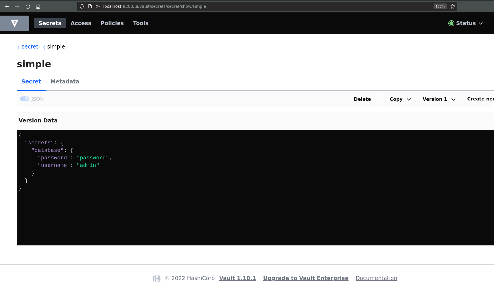

# start local vault

For this example, we start a Vault service locally, which we equip with a secret

```bash
VAULT_TOKEN=admintoken
docker run -p 8200:8200 --cap-add=IPC_LOCK -d -e "VAULT_DEV_ROOT_TOKEN_ID=${VAULT_TOKEN}" --name=dev-vault vault
curl \
    -H "X-Vault-Token:  ${VAULT_TOKEN}" \
    -H "X-Vault-Request: true" \
    -H "Content-Type: application/json" \
    -X POST \
    -d '{"data":{"secrets": {"database": {"password": "password","username": "admin"}}}}' \ 
    http://127.0.0.1:8200/v1/secret/data/simple
```

```json
{
  "secrets": {
    "database": {
      "password": "password",
      "username": "admin"
    }
  }
}
```